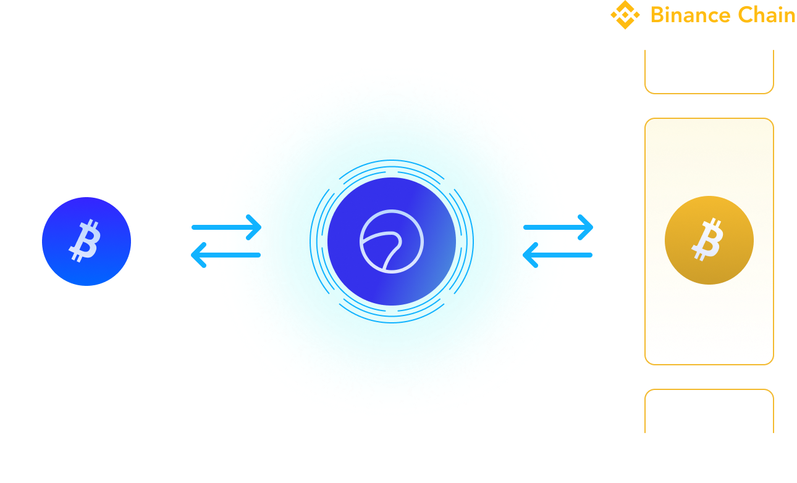

# Summary

## Overview

Swingby Skybridge is a proof-of-stake decentralized ephemeral custodian protocol for the cross-chain movement of crypto assets. It enables fast trust-free bridges between BTC, Ethereum, Binance Chain and other blockchains.

At its core, Swingby Skybridge uses cryptography derived from the paper entitled _Fast Multiparty Threshold ECDSA with Fast Trustless Setup_ by _Rosario Gennaro_ and _Steven Goldfeder_ which describes threshold ECDSA signature scheme protocols that support efficient, dealer-less key generation and distributed computation of digital signatures.

Swingby Skybridge implements a [layer 2](https://www.binance.vision/glossary/layer-2) proof-of-stake consensus system and peer-to-peer network to facilitate inter-blockchain swaps using these cryptographic protocols. The first reference implementation is now live on our [testnet](https://bridge-testnet.swingby.network).

### Decentralized Token Bridges

The Swingby Skybridge network consists of clusters of nodes that manage decentralized wallets using threshold signatures cryptography to form multiparty signature wallets and use those to facilitate token swaps.

This means that coins can be sent from one chain and appear on another as quickly as the underlying chains can process the blocks. There's no need to trust a third party -- no single person or company has access to the deposits while they are being swapped.

Performing a swap on Swingby Skybridge is as easy as sending the coins – there's no need to use a special wallet app.

### **Modern Cryptography, Applied**

By utilizing recent developments in cryptographic research, the tokenization of BTC on other chains, an ambition that has proven difficult to achieve with prior technologies, can be realized simply and securely.

Traditional approaches to this problem have used complex multi-signature transactions and script op-code methods like Hash Time-Lock Contracts \(HTLCs\) which require bespoke wallet apps and are not widely supported. 

_Swingby Skybridge_ aims to apply modern cryptography for the real world to address gaps in the cross-chain DeFi ecosystem.

## Contents









### Getting Started







### Technical Details





