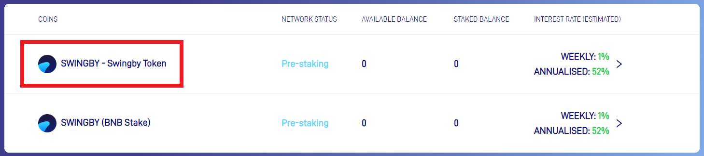
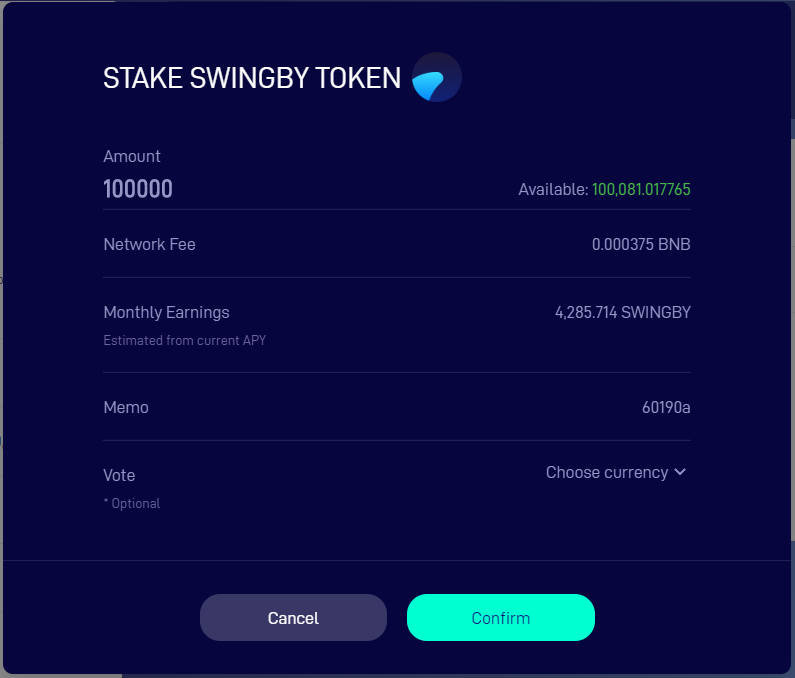
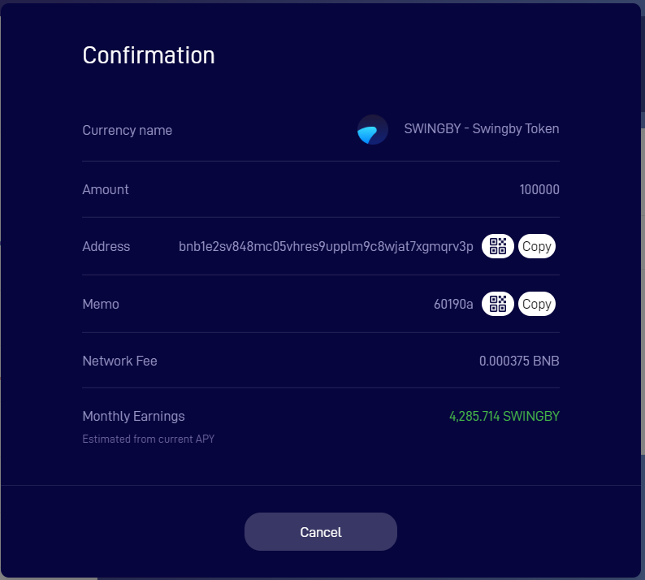
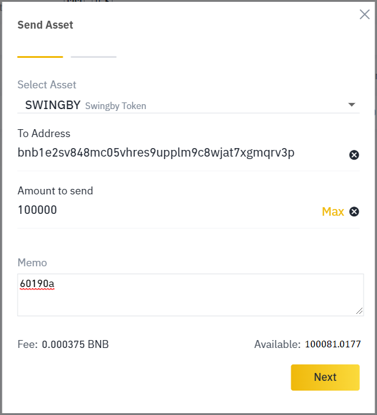
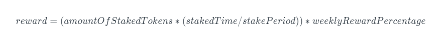

# How to stake SWINGBY tokens?

To set the direction of Swingby development, anyone interested in the Swingby ecosystem has  the option to stake their Swingby tokens and vote for the next chain that should be integrated with their stakes. 

The staked tokens will be rewarded with 1% interest distributed on a weekly basis, and these rewards will reduced with each development milestone achieved:

| Milestone | Reward per week |
| :--- | :--- |
| Until BTC mainnet launch | 1% |
| Until second swap pair | 0.75% |
| Until third swap pair | 0.5% |
| Until fourth swap pair | 0.25% |
| After fourth swap pair | No reward |

The gradual reduction of pre-stake rewards is to ease the transition from pre-staking to node staking.

### TrustWallet and other mobile wallet providers



### Binance DEX

1. Navigate to [https://stake.swingby.network/](https://stake.swingby.network/)
2. Click on the token that you want to stake, for pre-staking that would be SWINGBY.

3. Enter the public address that holds your SWINGBY tokens in the top field and click "Set Address".

4. You will now see available tokens in the left column. Click "Stake".

5. Enter the amount of tokens that you would like to stake. You can optionally vote for next swap pair to implement. Voting does not affect staking rewards.

6. Save the confirmation screen for use in later steps.

7. Login on [Binance DEX](https://www.binance.org/) with the wallet you entered as public address.

8. Send the amount of SWINGBY tokens to your own address with the memo, as seen in the previous confirmation screen. **NOTE**: you will need a small amount of BNB tokens to pay for network fee.

9. You confirmation screen on [https://stake.swingby.network/](https://stake.swingby.network/) should now have changed to "Staking Successful".

10. **DO NOT** send any SWINGBY tokens from that address! If you do, it will cancel the staking time for that week. You will need to re-stake and reward will be counted from the new staking time instead.

### How to stake with any wallet? \(Advanced only!\) 

1. Choose a wallet that supports transactions with MEMO.
2. Unlock your wallet with an address that holds SWINGBY tokens.
3. Find the latest pre-stake MEMO on the official Telegram, Twitter, and website: [https://stake.swingby.network/](https://stake.swingby.network/token/SWINGBY)
4. Send any amount of SWINGBY tokens either back to the same address \(self-send\) or to any other address that you want to use as your staking address. The transaction need a MEMO in following format: “XXXXXXXX\_YYYYYY” where: XXXXXXXX = Alphanumeric weekly staking code \(**changed every week, make sure you have the correct staking code by double-checking on the official website, Twitter, and Telegram\)**. **** YYYYYY = Optional token ticker symbol to vote for the next chain to integrate. _**Example:** 60190a\_BTCETH_
5. The amount of SWINGBY tokens sent will be counted as "pre-staked". 
6. Do not send any SWINGBY tokens from the staking address for the rest of the week. **Sending any amount of SWINGBY tokens from a pre-staked address to any other address will cancel the whole stake for that week.**
7. At the end of the week, all pre-staked addresses will receive reward using following formula:

Example:  
Assuming 100 tokens, held for 50% of the week, 1% weekly staking reward.  
_\(100\*\(50/100\)\)\*0.01\) = 0.5_  SWINGBY tokens received as distribution.

   8. Re-stake with the new MEMO released every week for continuous rewards.

