# BNB Staking Campaign

You can participate in BNB staking campaign by sending BNB to your own address with a memo. You control your own tokens during the staking. This is the same process as SWINGBY Pre-staking that is soon to be released.

There are two guides below; one for using Binance DEX and one for using Trust Wallet \(mobile app\).

### How to stake \(basic, [B](https://trustwallet.com/)inance DEX\)

1. Navigate to [https://stake.swingby.network/](https://stake.swingby.network/)
2. Enter the public address \(BEP-2\) that holds your BNB tokens in the top field and click "Set Address".

4. You will now see available tokens in the left column. Click "Stake".

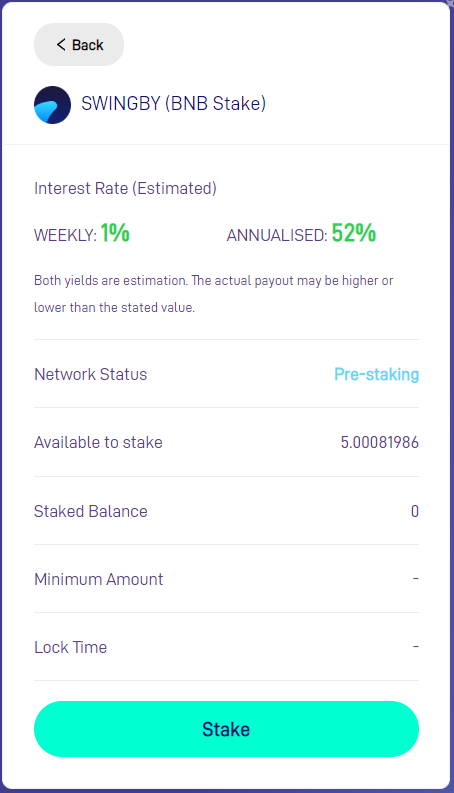

5. Enter the amount of tokens that you would like to stake and click on "Confirm".  
_Optional: You can choose to vote for a currency as next trading pair. Memo code will change if you select to vote, everything else is the same._

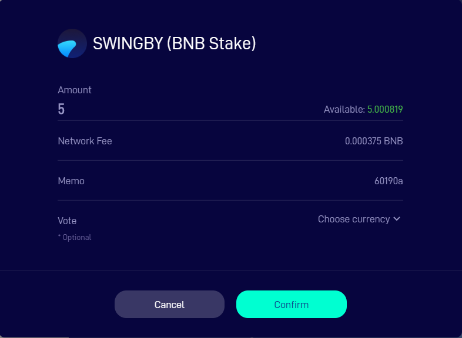

6. Save the Confirmation window for use in later steps by keeping the window open or taking a screenshot. 

We recommend to keep the window open to receive staking status feedback automatically at later steps.

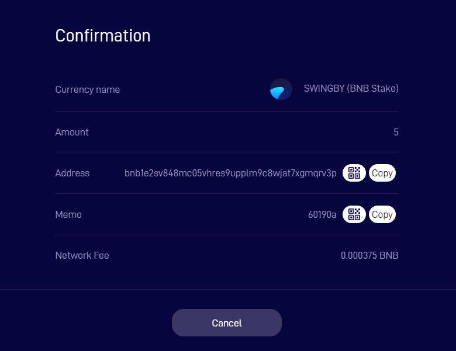

7. Login on Binance DEX, [https://www.binance.org/](https://www.binance.org/) with the wallet you entered as public address.

8. Send the amount of SWINGBY tokens to your own address with the memo, as seen in the previous confirmation screen. **NOTE**: You will need a small extra amount of BNB tokens to pay for network fee.

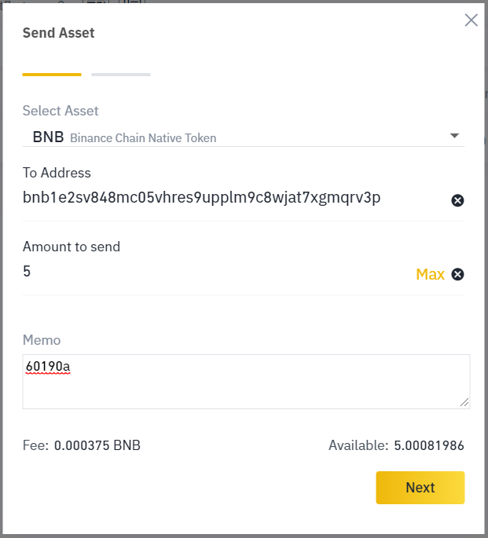

9. The confirmation screen in your browser on [https://stake.swingby.network/](https://stake.swingby.network/) should now automatically change to "Staking Successful".

10. **DO NOT** send any BNB tokens from that address before you received your rewards! If you do, it will cancel the staking. You will need to redo the staking from start again and reward will be counted from the new staking time instead.

### 

### How to stake \(basic, [Trust Wallet](https://trustwallet.com/)\)

Please jump to step 7 if you already have Trust wallet but no BNB tokens.  
Please jump to step 9 if you already have Trust wallet with BNB tokens.

1. Install Trust Wallet. This guide uses the Android version.
2. Create a new wallet or import an existing BEP-2 wallet \(jump to step 9 if you import a wallet with BNB tokens\).

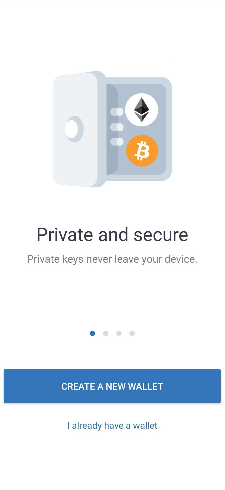

3. Click continue

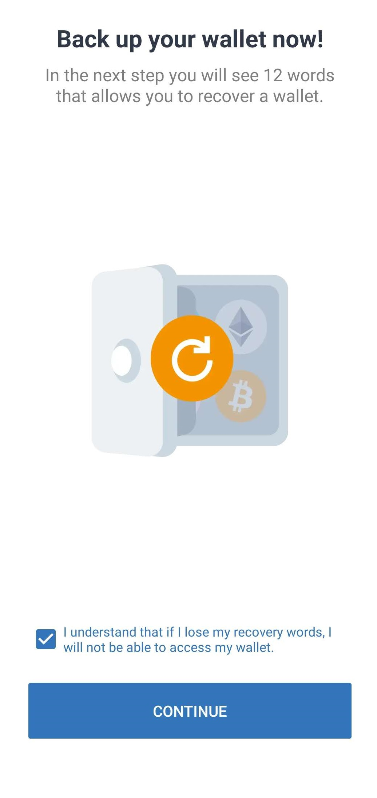

4. Save Recovery Phrase in a secure place**.  
Do not lose the recovery words! You will not be able to access the wallet without these.  
Do not store the recovery words where anyone unauthorized may get access to them.**

5. Verify recovery phrase by entering them in the correct order.

6. Click "Done".

7. This is the wallet overview. Click on BNB.

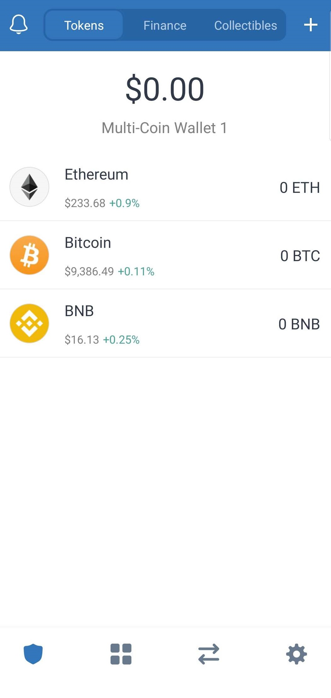

8. Either click "Buy BNB" or "Receive" to transfer BNB to your wallet. Follow the steps described in the .apa .

9. You should now have a Trust Wallet with BNB tokens.

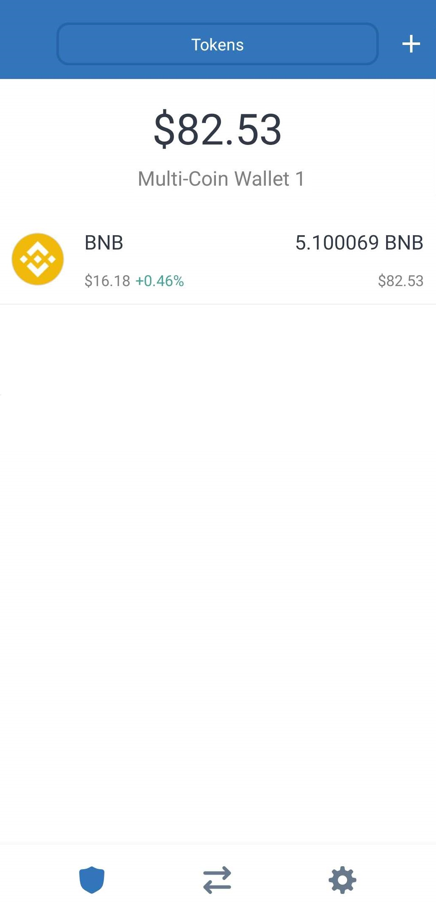

10. Click on BNB and "Receive" to see your BEP-2 address. Confirm that the address starts with "bnb".

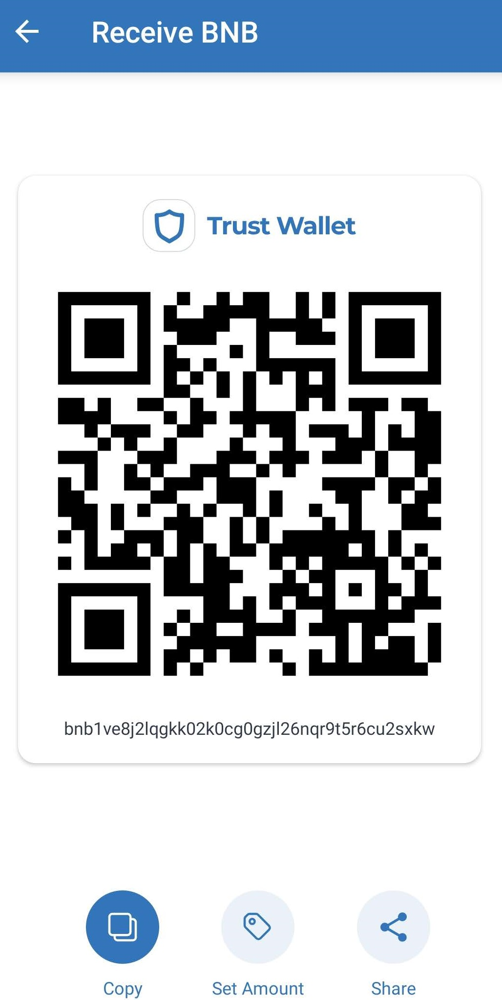

11. Copy the address.

12. Open your Internet browser and navigate to [https://stake.swingby.network/](https://stake.swingby.network/)

13. Enter the public address \(BEP-2\) copied from the previous step in the top field and click "Set Address".

14. You will now see available tokens in the left column. Click "Stake".

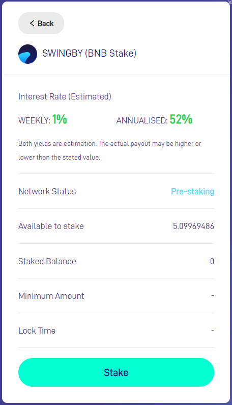

27. Enter the amount of tokens that you would like to stake and click on "Confirm".  
_Optional: You can choose to vote for a currency as next trading pair. Memo code will change if you select to vote, everything else is the same._

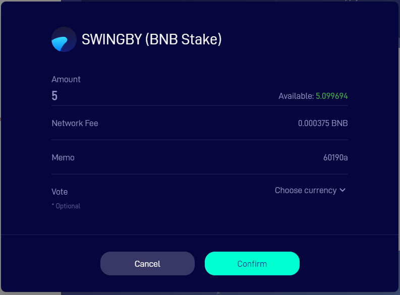

28. Save the Confirmation window for use in later steps by keeping the window open or taking a screenshot. 

We recommend to keep the window open to receive staking status feedback automatically at later steps.

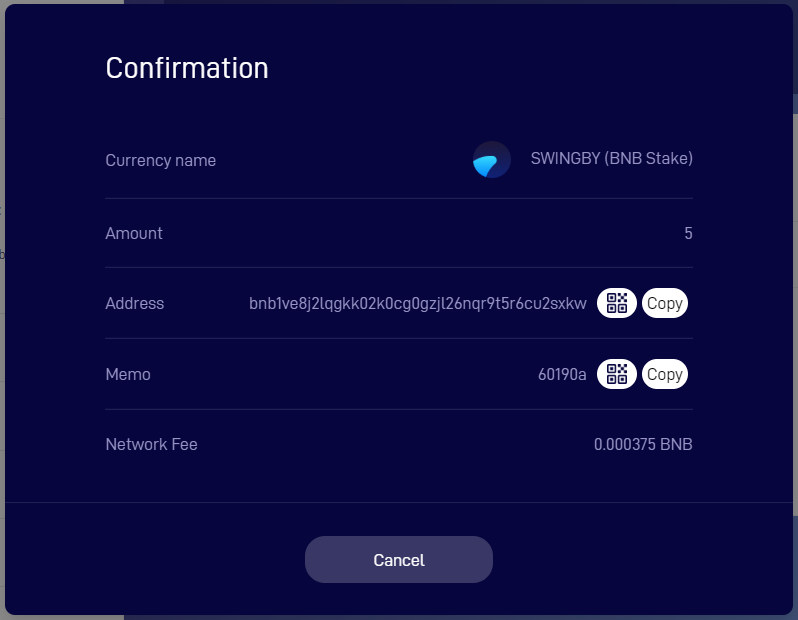

29. Go back to Trust Wallet app. Click on BNB and then click "Send".

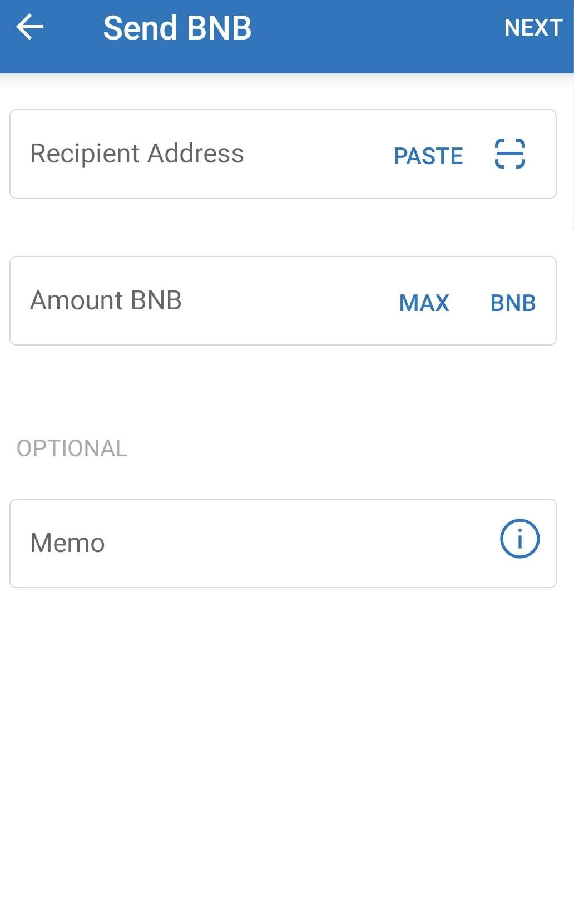

30. Fill in the same information as shown in step 28. Click "Next".

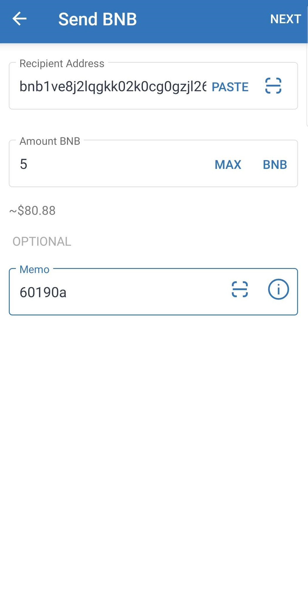

31. Confirm that the information is correct. "From" and "to" should be the **SAME ADDRESS.** You control your own tokens during the staking. Click "Send" after you have manually confirmed the information.

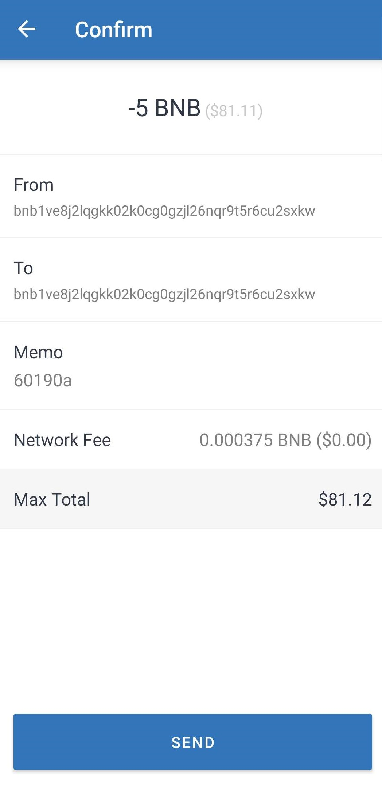

32. The confirmation screen in your browser on [https://stake.swingby.network/](https://stake.swingby.network/) should now automatically change to "Staking Successful".

33. **DO NOT** send any BNB tokens from your wallet before you have received your rewards! If you do, it will cancel the staking. You will need to redo the staking from start again and reward will be counted from the new staking time instead.

