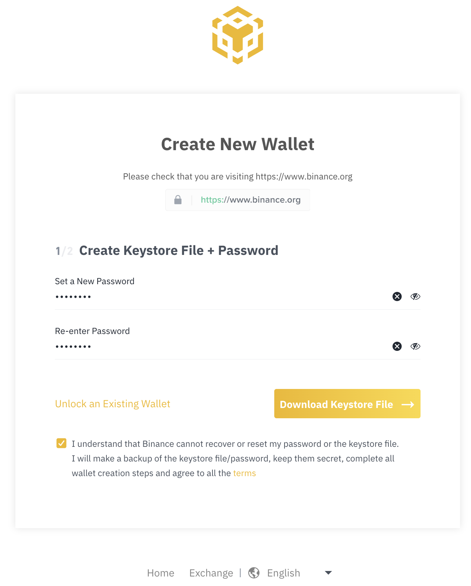
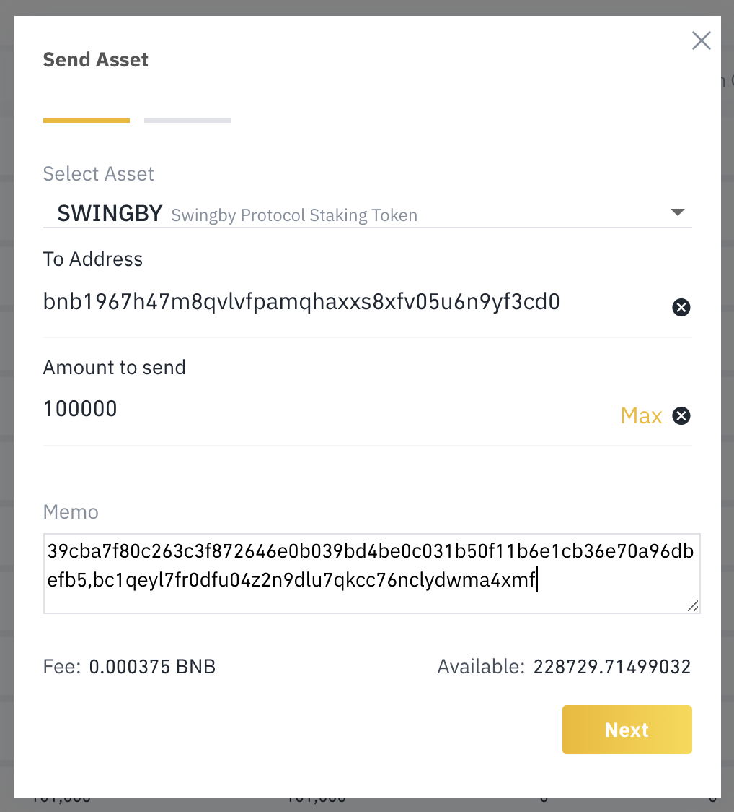

# Full node staking

**Overview:**

1. Git clone the source code.
2. Build the node binary.
3. Copy and edit the configuration file.
4. Start the node to get its P2P public key.
5. Send the staking transaction from your Binance Chain wallet.
6. Enter the staking transaction into your node's configuration.
7. Start the node with the valid stake.

**Note:** Please make sure that you have the latest stable version of the [Go language runtime](https://golang.org/dl) installed. At the time of writing this is version 1.13.7.

**Step 1.** Git clone the source code: [https://github.com/SwingbyProtocol/swapd-go](https://github.com/SwingbyProtocol/swapd-go)

```text
$ git clone https://github.com/SwingbyProtocol/swapd-go && cd swapd-go
```

**Step 2.** Build the node binary.

```text
$ make build
```

**Step 3.** Copy and edit the configuration file.

```text
$ cp -a ./configs/dist ./configs/prod
$ nano ./configs/prod/config.toml
```

You should set the `moniker` of your node to a name personal to your node, and check all of the other parameters in the file. Most importantly, you should check that the coins, endpoint URLs and `keygen_until` match up with the rest of the nodes on the network that you are trying to join.

For now, there is no need to edit the staking TXID or address. Once you are ready, you can proceed to start the node.

**Step 4.** Start the node.

```text
$ ./build/swapd --home ./configs/prod --p2p.port 12121
```

You should see some output similar to this:

```text
Skybridge Node Release: 0.1.0; Commit: 419afa96

INFO 14:58:01.626 Init Getting clock offset from ntp servers... pool.ntp.org time.nist.gov
INFO 14:58:01.655 main The time synced with ntp is: 2020-02-08 14:58:01.665838528 +0700 +07 m=+0.089681419
INFO 14:58:01.659 main Reading or generating the keystore (this may take a while)...
INFO 14:58:01.659 func2 generating the safe primes for the signing proofs, please wait...
INFO 14:58:01.659 func1 generating the Paillier modulus, please wait...
INFO 14:58:04.546 func2 safe primes generated. took 2.886741414s
INFO 14:58:05.898 func1 paillier modulus generated. took 4.238507662s
INFO 14:58:05.945 main Generated a new keystore: configs/dist/data/keystore.json
INFO 14:58:05.945 main The stored p2p public key is: 39cba7f80c263c3f872646e0b039bd4be0c031b50f11b6e1cb36e70a96dbefb5
INFO 14:58:05.945 Start Starting IndexerService impl IndexerService
INFO 14:58:05.945 OnStart IndexerService starting. Indexer connecting...
INFO 14:58:06.332 OnStart IndexerService starting. Indexer connected.
INFO 14:58:06.822 Start Starting BnbClientService impl BnbClientService
INFO 14:58:06.822 OnStart BnbClientService starting. Bnb client connected.
INFO 14:58:06.822 Start Starting StakeValidatorService impl StakeValidatorService
INFO 14:58:06.822 OnStart StakeValidatorService starting.
INFO 14:58:06.822 main Waiting 3s for blockchain client connect...
INFO 14:58:09.825 Start Serving peer protocol on 127.0.0.1:12121
INFO 14:58:10.326 synchroniseKVStore Syncing KV store with other peers
WARN 14:58:10.326 synchroniseKVStore Unable to sync KV store from other peers - received 0 KV store proposals
INFO 14:58:10.326 synchroniseKVStore Syncing KV store with other peers
WARN 14:58:10.326 synchroniseKVStore Unable to sync KV store from other peers - received 0 KV store proposals
ERRO 14:58:10.599 ValidateStake Stake TX query error: RPC error -32603 - Internal error: Tx (0000000000000000000000000000000000000000000000000000000000000000) not found
panic: invalid stake tx for this peer
```

This output indicates that your stake has not yet been established. We will do that next. Find this line in the output and copy the hex string of the P2P public key:

```text
INFO 14:58:05.945 main The stored p2p public key is: 39cba7f80c263c3f872646e0b039bd4be0c031b50f11b6e1cb36e70a96dbefb5
```

In this example, the P2P public key is `39cba7f80c263c3f872646e0b039bd4be0c031b50f11b6e1cb36e70a96dbefb5`. Copy this to your clipboard for later.

**Step 5.** Send the staking transaction from your Binance Chain wallet.

**Step 5.1.** Create or unlock your Binance Chain wallet on the Binance Chain web wallet: [https://binance.org/unlock](https://binance.org/unlock).

You can unlock your wallet with any of the methods allowed, including Trust Wallet, Ledger device, Trezor device or Keystore file.



**Step 5.2.** Once you have unlocked your wallet, navigate to the _Balances_ page and find your wallet address. This is the address where you will send your SWINGBY tokens to.


**Step 5.3.** Send the SWINGBY tokens that you would like to stake to your wallet address \(above\).

Note: At the moment the required stake to run a full node is 100,000 SWINGBY. Sending more tokens than this will not give your node extra privileges nor generate extra income from swaps.

**Step 5.4.** Send the staking transaction.

The staking transaction is a self-send for the amount of tokens that you would like to stake. Click the _Send_ button next your SWINGBY token balance row and enter the details.

In the Memo box, you should paste your P2P public key that you copied in Step 4. After that, you should enter a comma \(`,`\) followed by your BTC address that you would like to receive reward payments to.

**Note:** The BTC address for rewards should **not** be an exchange address as those addresses may change at any point in time. You should enter an address that **you control the keys for** such as from a Trust Wallet or Ledger device.



**Step 6.** Enter the staking transaction into your node's configuration. Back in your terminal:

```text
$ nano ./configs/prod/config.toml
```

Find the following lines in your configuration file:

```text
[bnb]
...
stake_tx = ""
stake_addr = ""
reward_addr = ""
[btc]
...
reward_addr = ""
```

In the `stake_addr` field you should enter the address that you are using to hold your stake. In this example the address is `bnb1967h47m8qvlvfpamqhaxxs8xfv05u6n9yf3cd0`.

In the `stake_tx` field you should add the TXID of your staking transaction. This is displayed in the _Transactions_ page in the Binance Chain web wallet and is a long string like this: `E2082A38EE937F922862B8DB24A8A1ACB2AADC1A394C617EEAF5D828136F4660`.

Your BNB `reward_addr` can be the same as your staking address or a new Binance Chain address that you would like to use for receiving swap rewards.

Your BTC `reward_addr` should be the same as the one that you entered for the staking transaction memo in Step 5.4. In this example that address was `bc1qeyl7fr0dfu04z2n9dlu7qkcc76nclydwma4xmf`.

**Step 7.** Start your node.

Note: Stakes take 72 hours to mature. You should wait for this period of time before starting your node or else you will see the same failure message as in Step 4.

```text
$ ./build/swapd --home ./configs/prod --p2p.port 12121
```

You should now see the node running with the valid stake.

If you experience any problems when trying to stake with your full node, please contact a member of the team on Telegram and they can help you.

