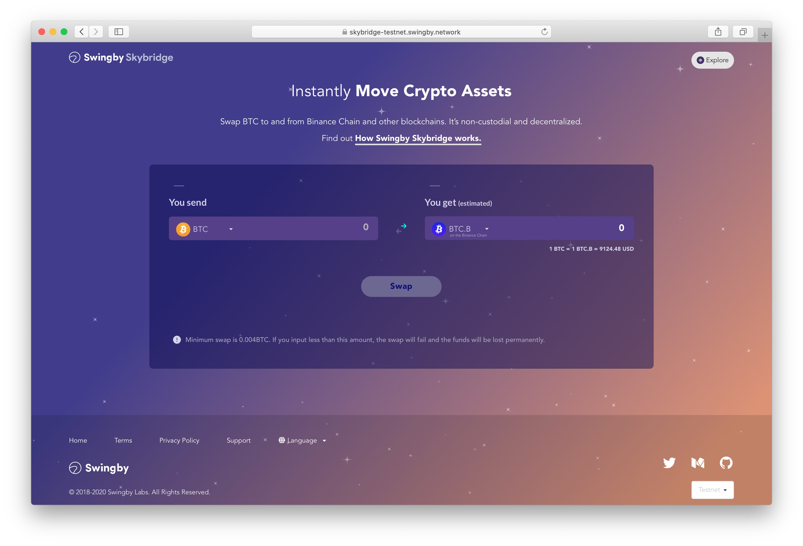
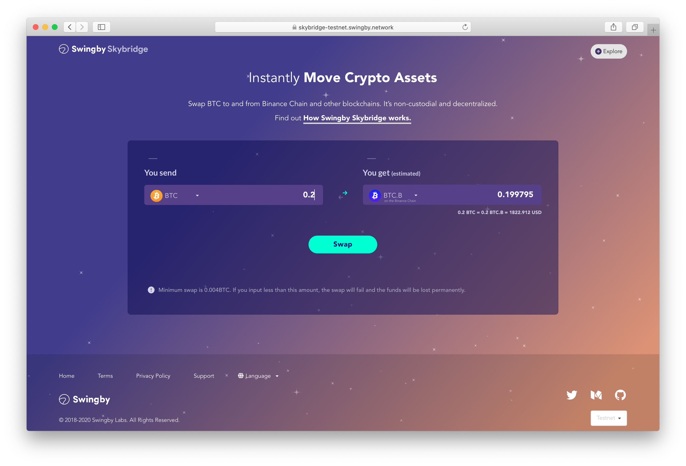
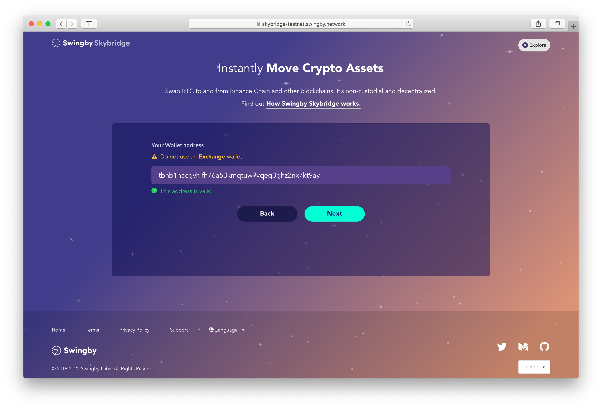
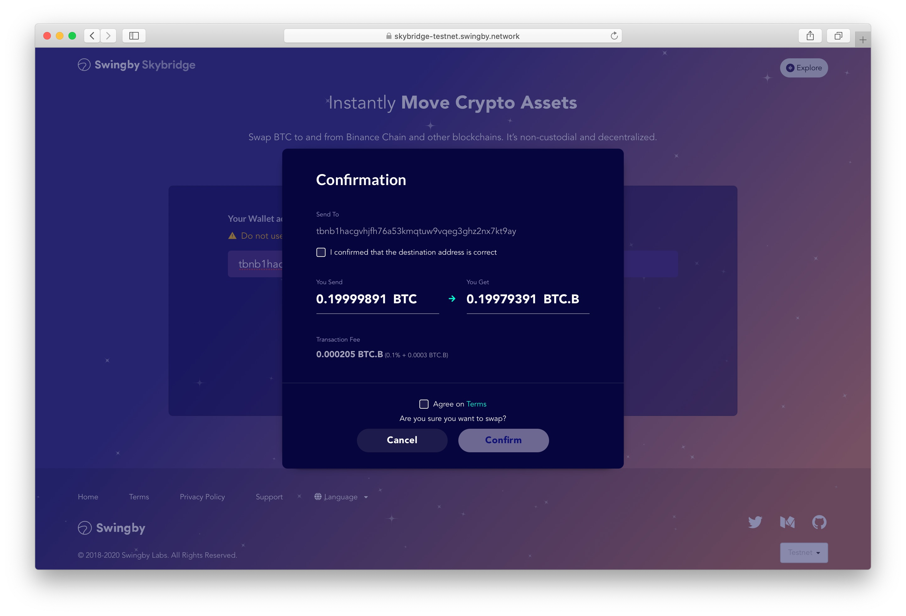
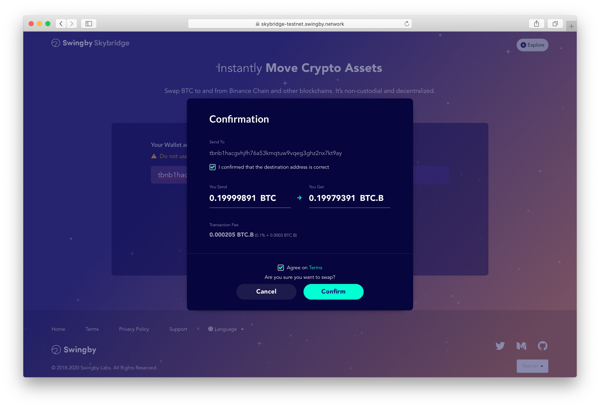
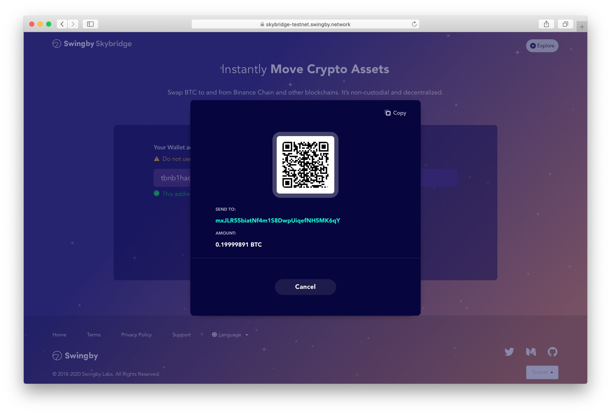
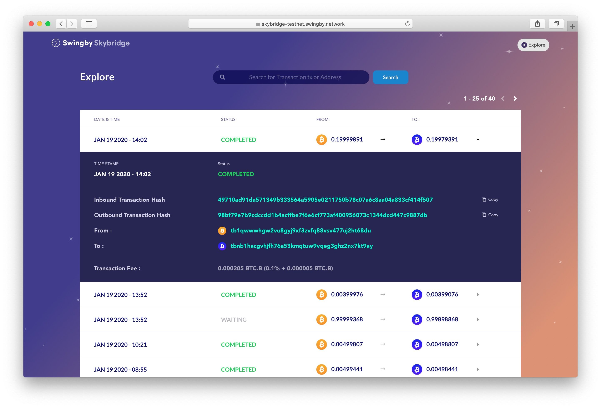

# BTC to BTC token swap


Note: _This is for the testnet of Swingby Skybrige \[_[_How it works_](../../how-it-works/)_\]. Testnet tokens have no value. If you need tBTC \(testnet BTC\), several faucet services are available:_  
[_https://coinfaucet.eu/en/btc-testnet/_  
](https://coinfaucet.eu/en/btc-testnet/)\_\_[_https://testnet-faucet.mempool.co/_](https://testnet-faucet.mempool.co/)

_You can generate a BTC testnet address here:_   
[_https://bitcoinpaperwallet.com/bitcoinpaperwallet/generate-wallet.html?design=alt-testnet_](https://bitcoinpaperwallet.com/bitcoinpaperwallet/generate-wallet.html?design=alt-testnet)\_\_

_You can generate a Binance Chain testnet address here:_  
[_https://testnet.binance.org/en/create_](https://testnet.binance.org/en/create)\_\_

_Swingby is running a faucet to get both kinds of testnet tokens._  
[_https://faucet.swingby.network_](https://faucet.swingby.network/)\_\_


The following steps to receive BTC Token \(BTC.B\) on Binance Chain:

* 1.You can access to the ****[**Swingby Skybridge testnet portal**](https://skybridge-testnet.swingby.network)  **\(**[**https://skybridge-testnet.swingby.network/**](https://skybridge-testnet.swingby.network/)**\)**

* 2. You can offer the token quantities.

* 3. Add your receiving address for BTC.B tokens

* 4. Click "Next" and checking the Confirm View 

* 5. Confirm all of forms and click "Confirm"

* 6. You can get address from deposit BTC to get BTC token. \(TSS custody address\)

* 7. You can get status of deposit transaction.

* 8. You can check transaction status on "Explorer"

* 9. Complete! \(all transactions is "mined"\)

