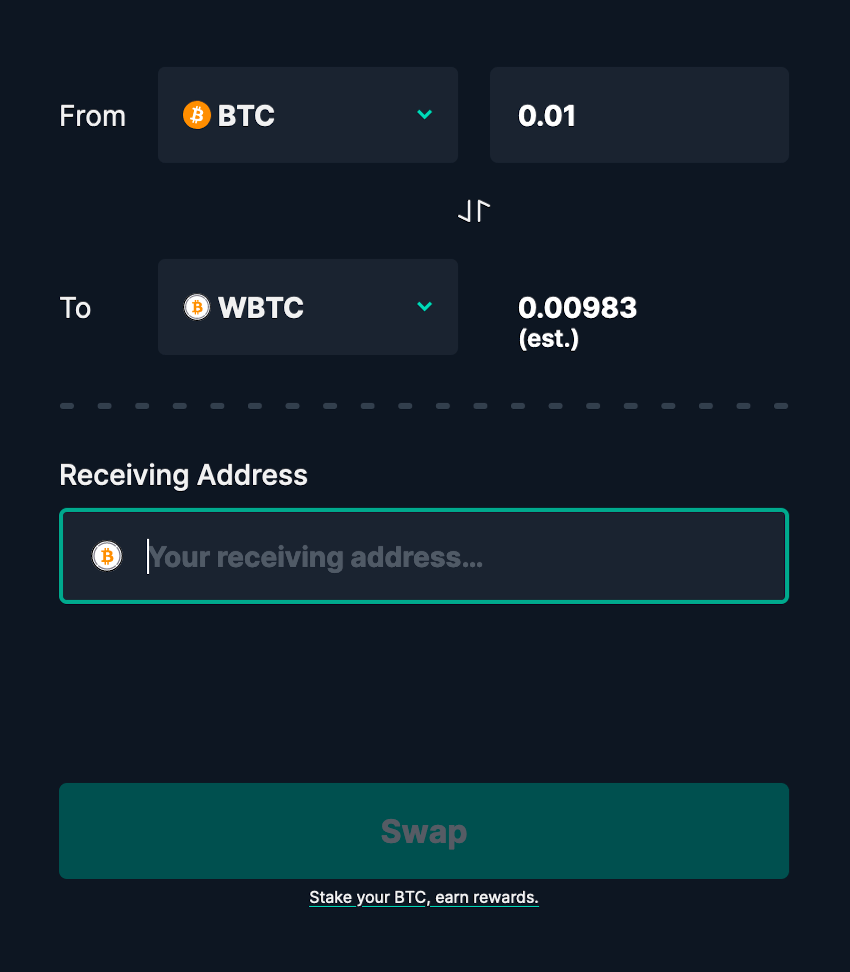
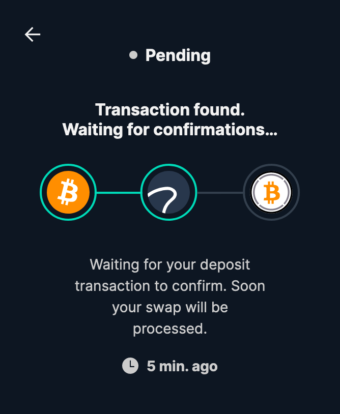

# BTC to WBTC \(on Ethereum\)


The following steps are to receive WBTC on the Ethereum blockchain from BTC on the Bitcoin blockchain.


1. Visit the ****[**Swingby Skybridge Swap Widget.**](https://app.skybridge.exchange/swap/new)\*\*\*\*

2. Select the quantity to swap and input your receiving address on the Ethereum blockchain.

3. Once the quantity and the receiving address are inputted, click "**Swap"**.

4. A BTC address to deposit your bitcoins will be displayed. It is the TSS custody address on the Bitcoin blockchain. Send BTC to this address by either scanning the QR code or copying the address to your favorite wallet.


You **can safely close your browser** while your transaction is being intercepted by the metanodes.


5. Once the transaction is intercepted by metanodes, its status refreshes automatically to "Transaction found".

6. Complete! 👏 Time to \#DeFi!

