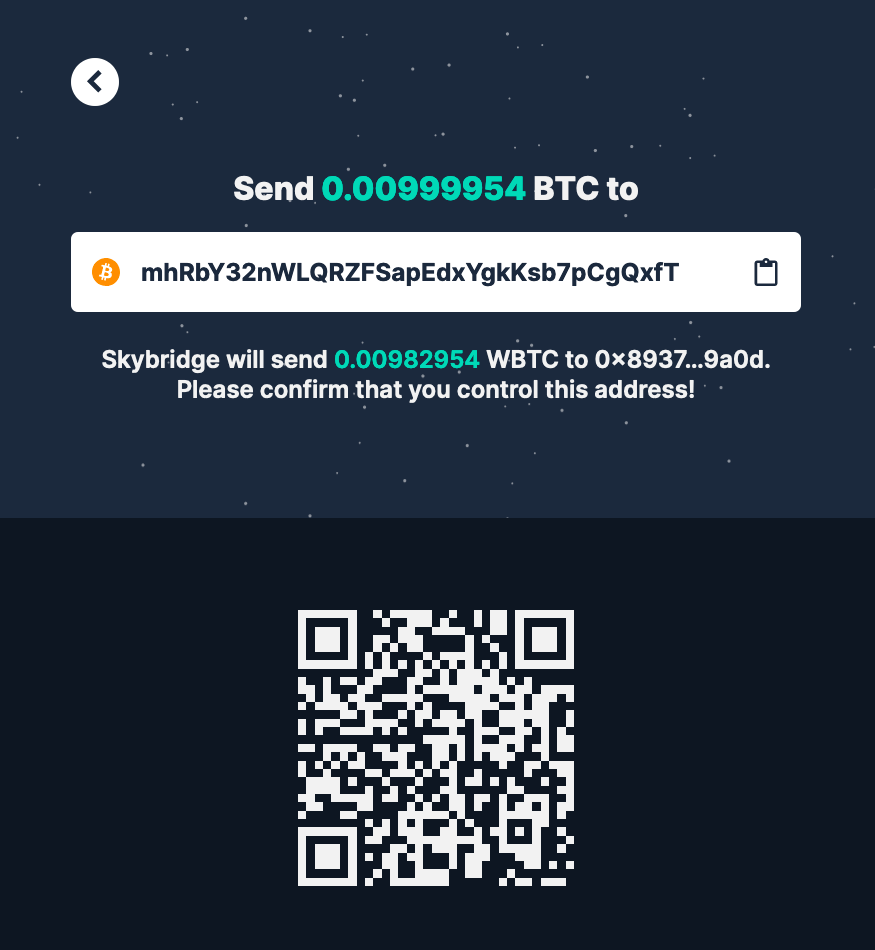

# BTC to WBTC \(on Ethereum\)


The following steps are to receive WBTC on the Ethereum blockchain from BTC on the Bitcoin blockchain.


1. You can access the ****[**Swingby Skybridge Swap Widget.**](https://app.skybridge.exchange/swap/new)\*\*\*\*

2. Select the quantity to swap. The quantity must be higher than 0.004 BTC.

3. Input your receiving address on the Ethereum blockchain.

4. Click "Next" and confirm.

5. A BTC address to deposit your bitcoins will be displayed. It is the TSS custody address on the Bitcoin blockchain. Send BTC to this address by either scanning the QR code or copying the address to your favorite wallet.

6. You can check transaction status on "Explorer".

7. Complete! 👏 Time to \#DeFi!

