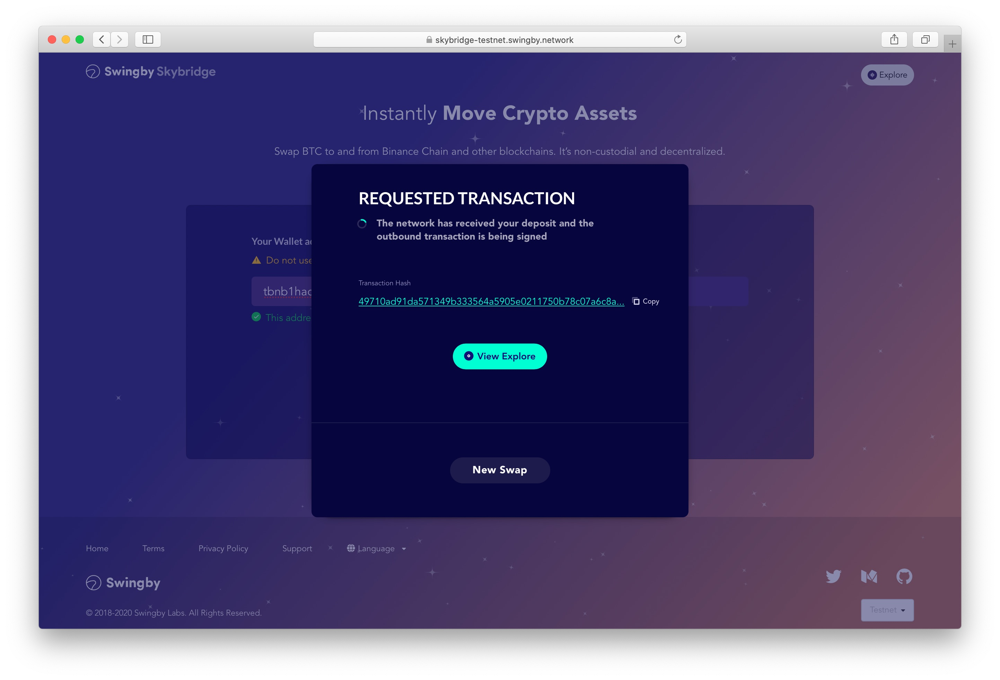

# BTC move to BTC Token

The following steps to receive BTC Token \(BTC.B\) on Binance chain:

* 1.You can access to the ****[**Swingby Skybridge testnet portal**](https://skybridge-testnet.swingby.network)  **\(**[**https://skybridge-testnet.swingby.network/**](https://skybridge-testnet.swingby.network/)**\)**

* 2. You can offer the token quantities.

* 3. Add your receiving address for BTC.B tokens

* 4. Click "Next" and checking the Confirm View 

* 5. Confirm all of forms and click "Confirm"

* 6. You can get address fro deposit BTC to get BTC token. \(TSS custody address\)

* 7. You can get status of deposit transaction.

* 8. You can check transaction status on "Explorer"

* 9. Complete! \(all transactions is "mined"\)


Note: _This is testnet of Swingby Skybrige \[_[_How it works_](../../how-it-works/)_\]. These tokens are no value. If you need tBTC, several fauset services are available._  
[_https://coinfaucet.eu/en/btc-testnet/_  
](https://coinfaucet.eu/en/btc-testnet/)\_\_[_https://testnet-faucet.mempool.co/_](https://testnet-faucet.mempool.co/)


