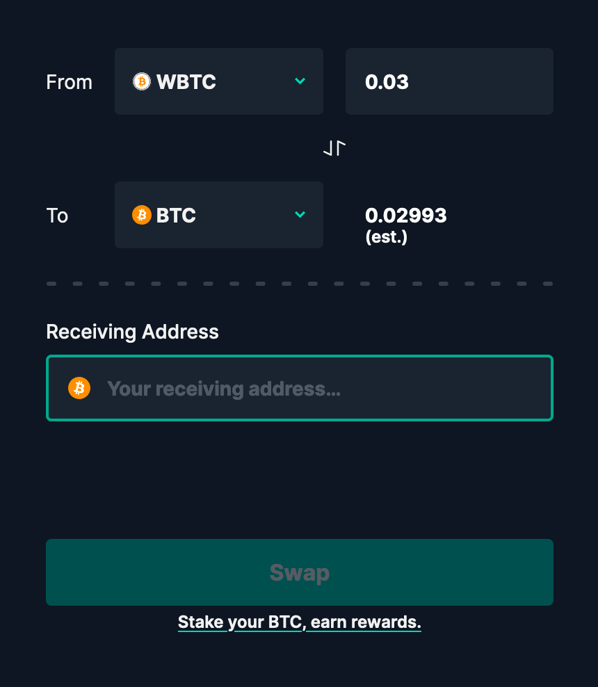
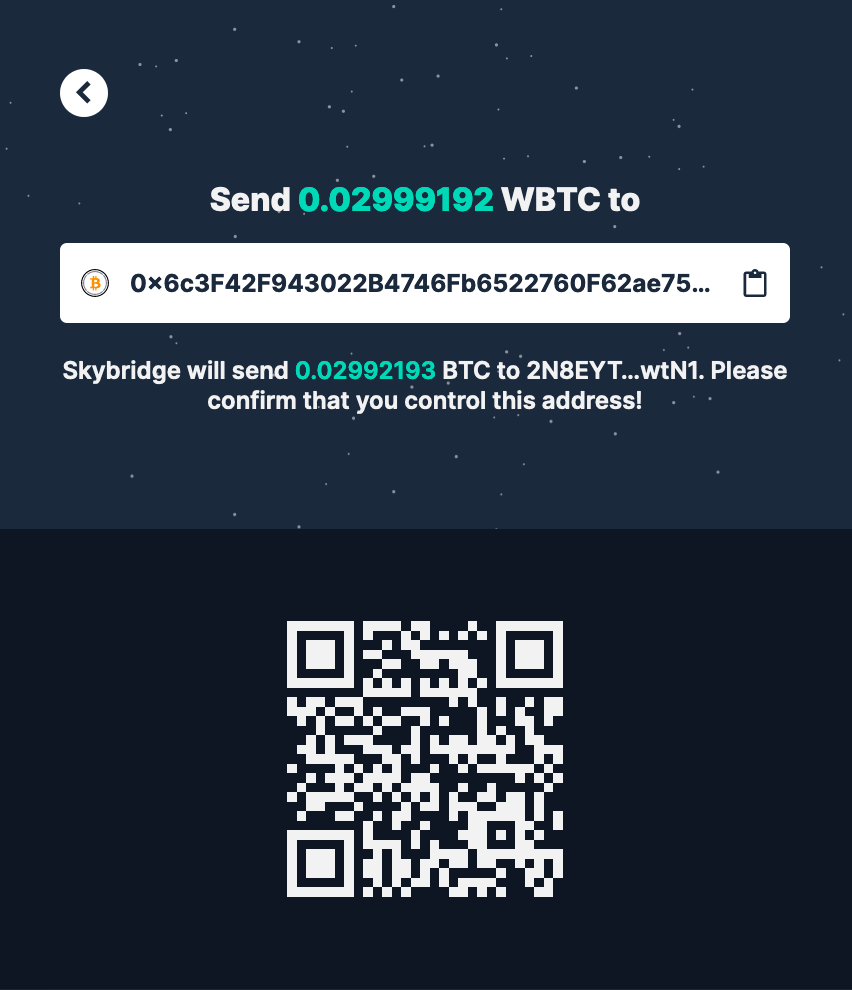
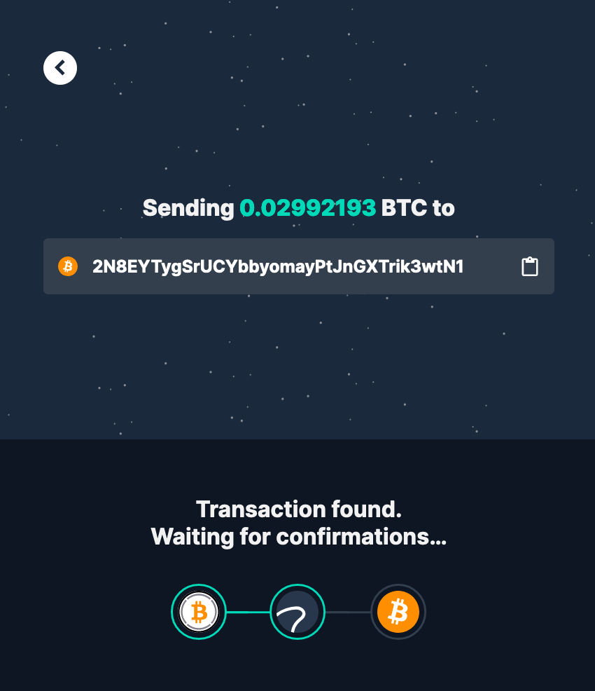
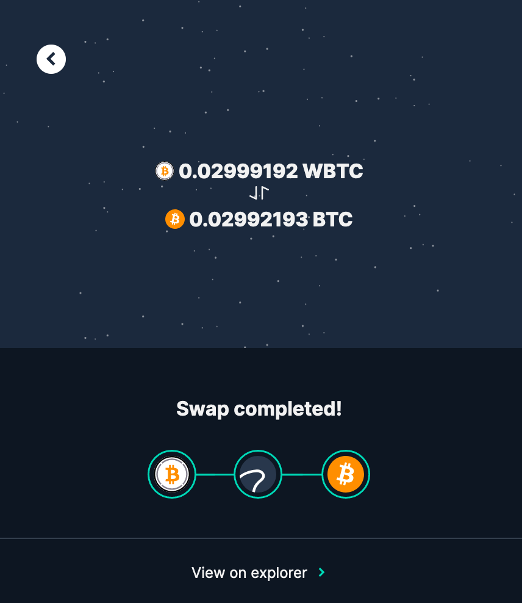

# WBTC \(on Ethereum\) to BTC swap


The following steps are to receive BTC on the Bitcoin blockchain from WBTC tokens on Ethereum.


1. Visit the ****[**Swingby Skybridge Swap page**](https://app.skybridge.exchange/swap/new)**.**

2. Select the quantity to swap and input your receiving address on the Bitcoin blockchain.

3. Once the quantity and the receiving address are inputted, click "**Swap"**.

4. An Ethereum address to deposit your WBTC tokens will be displayed. It is the TSS custody address on the Ethereum blockchain. Send WBTC to this address by either scanning the QR code or copying the address to your favorite wallet.


You **can safely close your browser** while your transaction is being intercepted by the metanodes.


5. Once the transaction is intercepted by metanodes, the status refreshes automatically to "Transaction found".

6. **Swap Completed**! 👏 Say _"welcome home"_ to your bitcoins!

