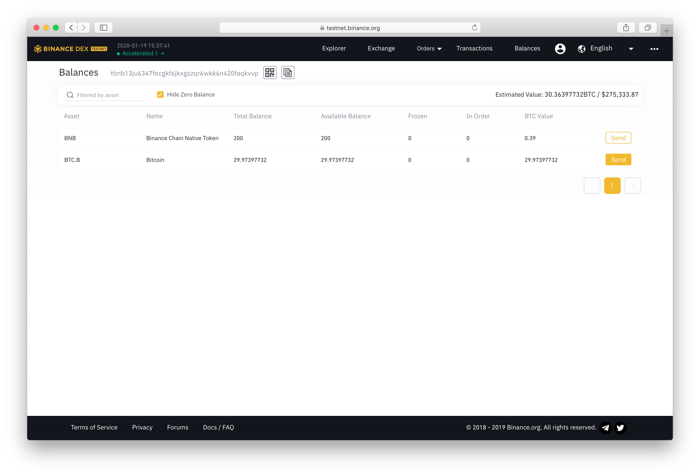

# BTC token to BTC swap

The following steps to receive BTC from BTC.B on the Binance Chain:

* 1.You can access to the ****[**Swingby Skybridge testnet portal**](https://skybridge-testnet.swingby.network)  **\(**[**https://skybridge-testnet.swingby.network/**](https://skybridge-testnet.swingby.network/)**\)**

* 2. You can select currency pairs \(**BTC.B** to **BTC\)**

* 4. Click "Swap" and checking the Confirm View 

* 5. You can create a transaction for swap in the [**Binance DEX testnet wallet**](https://testnet.binance.org/en/balances).

* 6. Create a transaction to the _**TSS address**_ for move BTC.B to BTC with memo: _**Your BTC receiving address**_

* 7. You can go back to "Explorer" on Skybridge portal to check your move transaction is 

* 8. Complete! \(all transactions is "mined"\)

