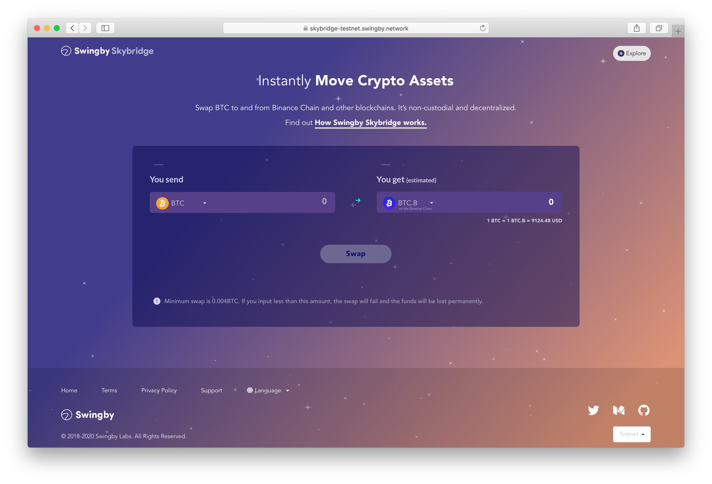

# BTC Token move to BTC

The following steps to receive BTC from BTC.B on the Binance chain:

* 1.You can access to the ****[**Swingby Skybridge testnet portal**](https://skybridge-testnet.swingby.network)  **\(**[**https://skybridge-testnet.swingby.network/**](https://skybridge-testnet.swingby.network/)**\)**

* 2. You can select currency pairs \(**BTC.B** to **BTC\)**

* 4. Click "Swap" and checking the Confirm View 

* 5. You can create a transaction for swap in the Binance DEX testnet wallet.

