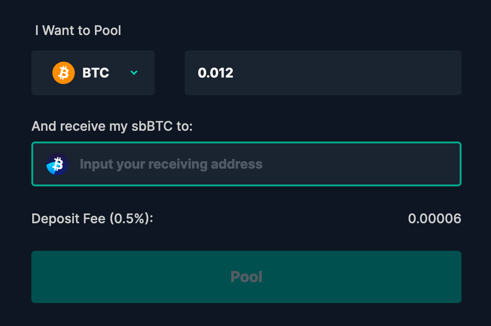
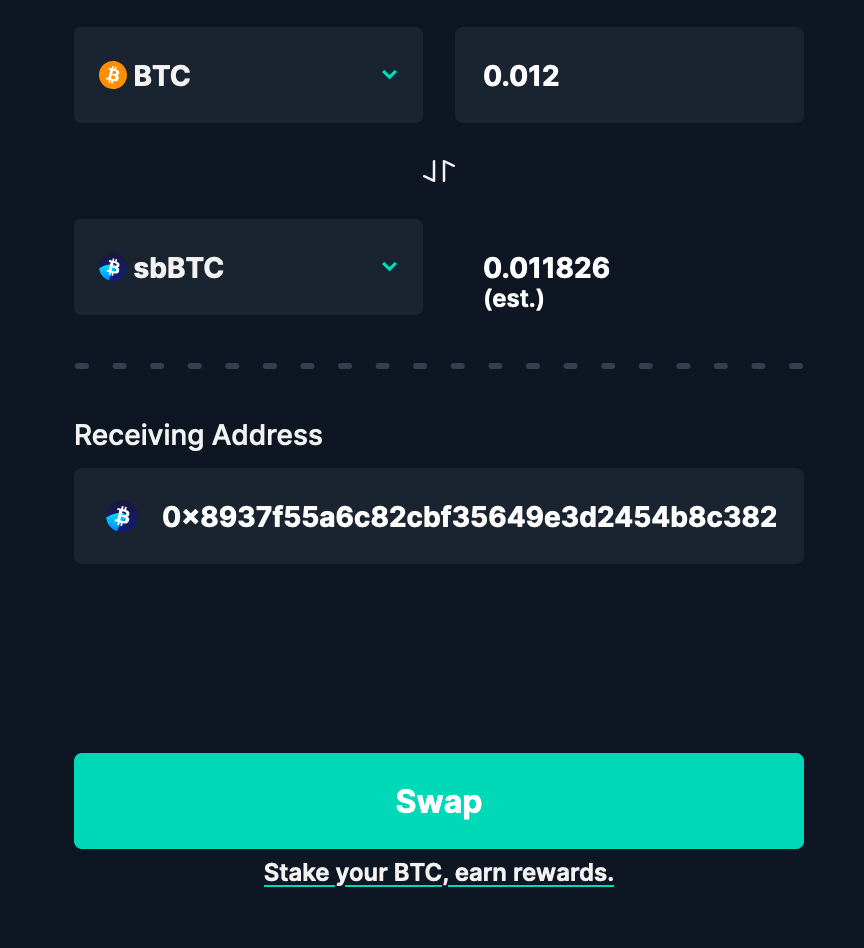
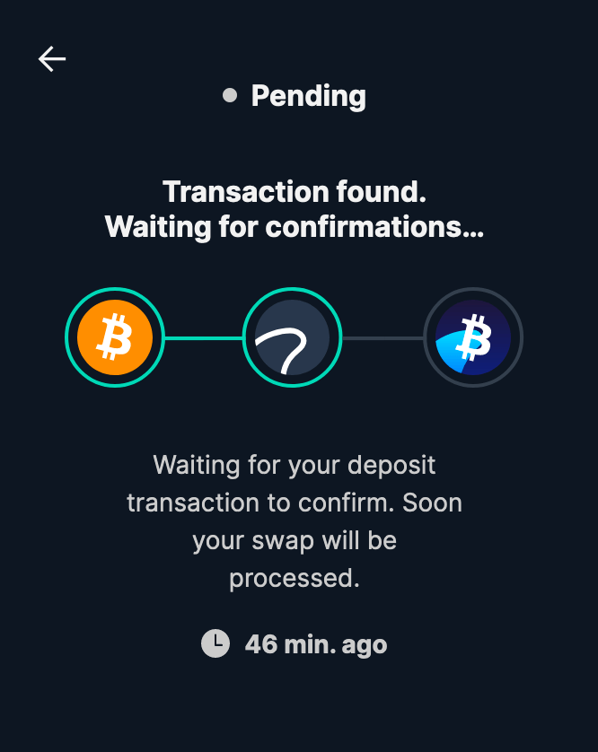
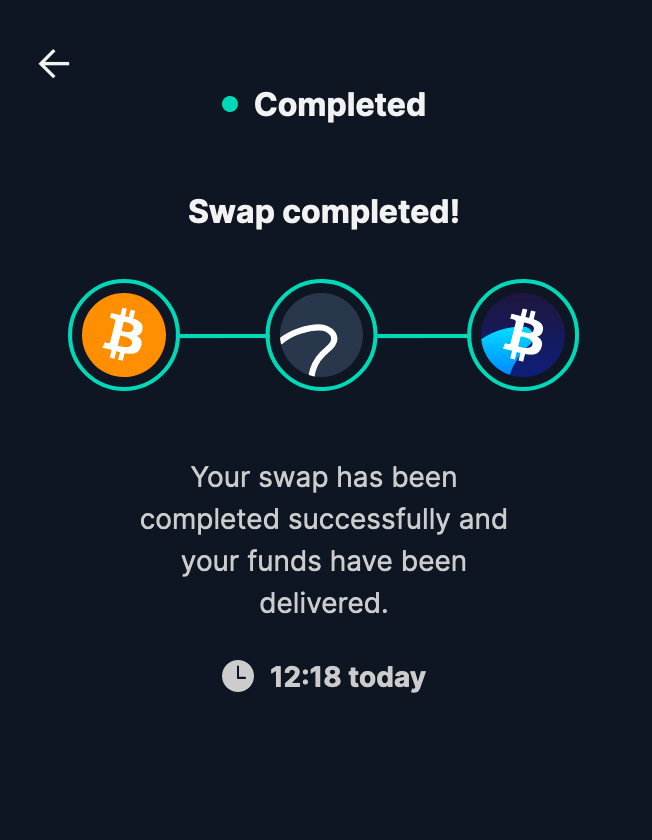

# Add liquidity

1. [Visit https://skybridge.info/pool](https://skybridge.info/pool).


The below example explains how to add liquidity by depositing BTC from the Bitcoin blockchain. The process to add liquidity with WBTC is similar.


2. Click the **"Add liquidity"** button at the top right of your screen.

3. Select what asset to deposit \(BTC or WBTC\), the quantity, and your Ethereum address to receive the sbBTC token. Once everything is correct, click **"Pool"**.

4. Verify that everything is correct and click **"Swap"**.


The sbBTC token price \(relative to BTC\) **increases over time** to reflect the compounding of swap fees to liquidity providers. It is normal that the price of 1 sbBTC is not equal to 1 BTC.


5. Send the quantity to the address displayed on the screen. The address is the TSS address controlled by the metanodes.


You **can safely close your browser** while your transaction is being intercepted by the metanodes.


6. Once the transaction is picked up by the nodes, the screen will refresh and indicate "Transaction found".

7. Once complete, it will display "Swap completed"! 🎉

