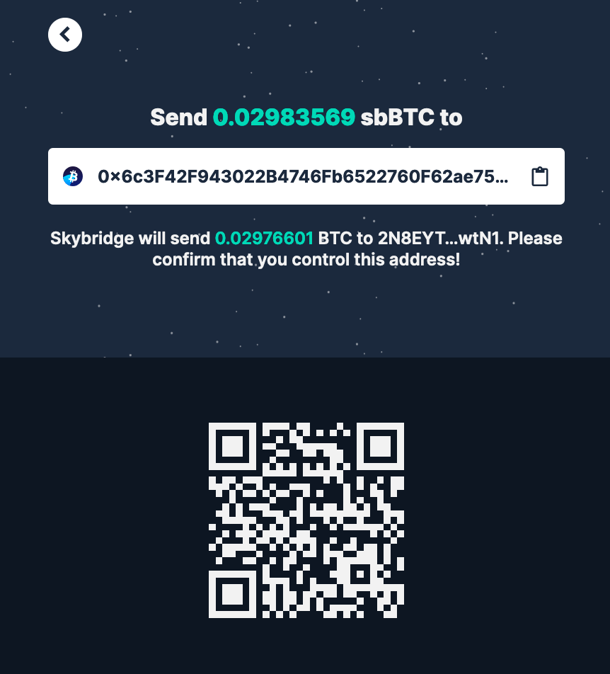

# Remove liquidity

1. [Visit https://skybridge.info/pool](https://skybridge.info/pool).


The example explains how to remove liquidity to the Bitcoin blockchain. The process to redeem your tokens to WBTC is similar.


2. Click the **"Withdraw"** button at the top right of your screen.

3. Input the address and the amount you wish to redeem and click **"Withdraw"**.

4. Confirm the transaction is correct and click **"Swap"**.

5. Send the sbBTC tokens for the amount displayed on screen to the Ethereum address \(the TSS address\).


You **can safely close your browser** while your transaction is being intercepted by the metanodes.


6. Once the transaction is picked up by the nodes, the screen will refresh indicating "Transaction found".

7. Once complete, it will display "Swap completed"! 🎉

