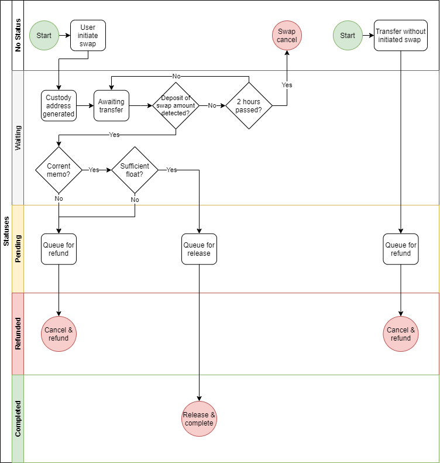

# Understanding a swap lifecycle

### Swap status flow diagram

The following diagram shows the decision tree used by the Skybridge nodes to decide which states that a swap moves through during processing.

### Why was my transaction refunded?

A transaction may be refunded for several reasons, such as:

* Lack of liquidity in the float pools.
* Timeout.
* Wrong amounts.
* Miscellaneous risk prevention in the node software.

