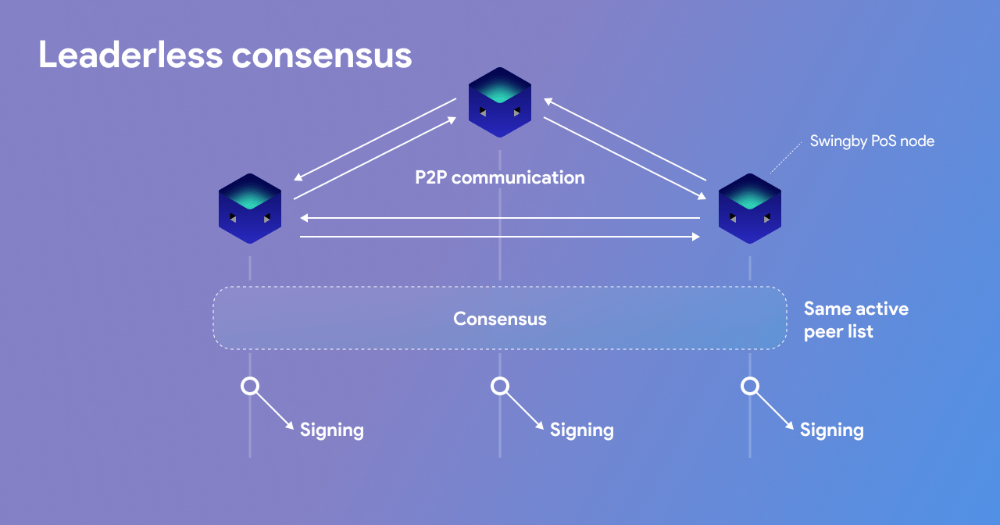

# Leaderless consensus

### **Parameter consensus**

Nodes need to agree on the TSS parameters they wish to use when creating the addresses. 

The two critical parameters from the TSS protocol are:

* _n_ - the total number of parties in the group who is able to partially sign a transaction
* _t -_ the threshold \(minimum\) number of parties who need to collaboratively sign the transaction.

Nodes would agree _t_ and _n_ out of band and consequently broadcast their intention to use them. Nodes will only attempt form groups with other nodes that use the same parameters.

In Chaosnet-MainNet, the protocol uses n = 60 and t = 32.  

In simple words, the TSS Group is created where 60 parties are needed to create the TSS public key, and where 32 of those 60 parties are required to come together to sign transactions.

### Transaction signing

Transactions needs to be signed for two main cases:

* Alice wishes to transfer her BTC to WBTC \(on Ethereum\). She uses Skybridge's interface and enters the amount of WBTC \(Ethereum\) she wishes and her respective address on the Ethereum blockchain where she wishes to receive it. The interface returns to her how many BTCs \(or satoshis!\) to send from her Bitcoin address to the TSS Group’s custodial BTC address.
* Bob wishes to transfer his WBTC \(Ethereum\) for BTCs on the Bitcoin blockchain. He sends WBTC \(Ethereum\) to the TSS Group’s custodial Ethereum address. Once received, the TSS Group will transfer bitcoins from its custodial BTC address to Bob's address on the Bitcoin blockchain.

Each of the TSS nodes monitors two custodial addresses on two blockchains \(Ethereum and Bitcoin\) that they are building a Skybridge between.

### **Peer blocking**

There are two cases to protect the network against:

* A peer is suddenly not responding due to network issues or downtime.
* A peer is being actively malicious \(sending bad data to the network or targeted peers\)

Since each peer is considered to have an equal voice, we follow a similar model to Bitcoin to _keep it simple_. Each peer maintains a "block list" of peers that it has blocked and the time that an entry exist in this list is configurable by each peer \(by default, 72 hours\).

A peer takes a risk by blocking another peer. Since the _sign set_ becomes smaller, it is selected to perform more work \(which consumes more power\) due to the following algorithm.

For example, with a threshold of 2, when a single peer \(3\) decides to block a peer:

1. Peer 1 - 10 other peers advertised in its sign set
2. Peer 2 - 10 other peers advertised in its sign set
3. Peer 3 - 9 other peers advertised in its sign set

In an alternate example, where more nodes are being individually blocked by peers:

1. Peer 1 - 9 other peers advertised in its sign set
2. Peer 2 - 5 other peers advertised in its sign set
3. Peer 3 - 8 other peers advertised in its sign set

The highlight shows which peers are included in the threshold list for the signing round.

The minimal subset of shared peers in all sign sets meeting the threshold is chosen deterministically by each peer. If a peer advertises a sign set that does not meet the threshold, it is ignored.

If this gets to a point that we are unable to meet the threshold, we must wait until a **Regroup** \(see ["Peer communication"](peer-communication.md)\) ****happens or force it through a governance feature.

