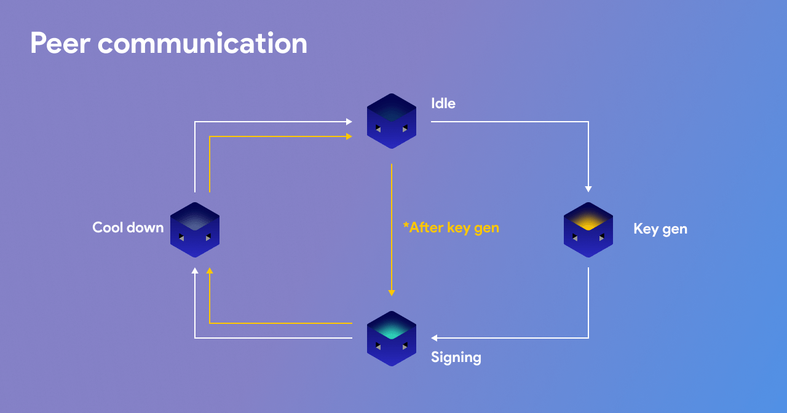

# Peer communication

### **Continuous pings**

Peers must send ping messages every 3 seconds, build peer list, check stakes, and ensure bad nodes are blocked.  
The ping message contains the status of the peer \(_"ok"_\), its state, a stake transaction, and a proof of the TSS share. Each correct ping triggers a stake check where balance must have been staked for at least 72 hours and never moved for each peer. Each adds a peer to its peer list.

### **Continuous signing**

All peers look **at incoming address for new tokens**, put them in list, and build tx. Incoming tokens must be in confirmed transactions and exist in an unconfirmed K/V.  
Each transaction contains: tx inputs and outputs, reward distribution, and refunds \(multi-send\).  
Each peer broadcasts a _sign proposal_ \(with a maximum of one per peer\):  
_&lt;sha512\_256\(tx\_sign\_doc\), sha512\_256\(peer\_id + tx\_sign\_doc\), tss\_proof&gt;_  
Each peer: _m\[0\] == own\[0\], m\[1\] == sha512\_256\(peer\_id + our\_sign\_doc\), ok\(tss\_proof\)_

Peers that pass are added to own _signing set_ that each peer will broadcast. Peers that broadcast _signing sets_ that do not meet the threshold **are ignored by other peers**.  
  
The minimal subset of _signing sets_ shared across at least _t_  peers is selected by each peer and all must be visible by each other. 

Subsets are selected repeatedly until one that meets the full threshold is found \(\*\). This solves an issue whereby two nodes would each broadast a _signing list_ that is _t_ in size but would contain different peers. Of this list, **peers are ordered by seniority** and peers with any non-unique _tss\_proofs_ are pruned from bottom-up to form the _threshold set_. 

Each peer in this list broadcasts a checksum of its _threshold set_ to prepare for signing. If any of these do not match up, **outliers are blocked** and we must wait until the next round and this round ends up aborting.   
  
To prevent double signs, peers will enter a **cooldown state** if they already noticde _&gt;= t+1_ peers in the signing state. By making sure the signing state is aligned to 1 minute intervals, peer lists can be regularly cleared.

### **Cooldown state**

Peers do not participate in signing until the next round epoch once they finish signing and the transaction\(s\) are broadcasted.

### **Keygen** 

**It r**eplaces “Signing” when in Keygen mode \(time &lt; keygen\_until\).

Each peer has the same _“keygen until”_ time set in config. Keygen runs repeatedly aligned to **5 minute intervals** until this time is reached. The in/out addresses will change until a certain block when it becomes “locked in” and permanent.The mainnet network needs to spend some time repeatedly generating the TSS shares for about 1 week to prove that no individuals would know the full private key.

### **Regroup**

The TSS algorithm can support reassigning shares among peers to prune out peers that have gone offline or are bad. This will happen every night at 00:00 UTC to bring in new peers and maintain the peer pool. 

Peers are **sorted by seniority in a descending order**. If anyone misbehaves during this process, the keygen attempt is skipped and each node records this event \(and the culprits!\) that caused it. If this happens repeatedly, a software update will be issued to address the problem. However, the protocol can continue using the old shares until then.  
  
**Important**: We must not allow peers to block each other from this process. This can be dangerous \(e.g., a cartel can enter the network and attempt a takeover\).

\(\*\): Each peer selects a candidate tx which contains the most valid transfers \(exact match or closest intersection\) with correct reward distribution output in view. Must contain at least one transfer or round is skipped. TX includes participant peer table checksum, also verified.  

  

