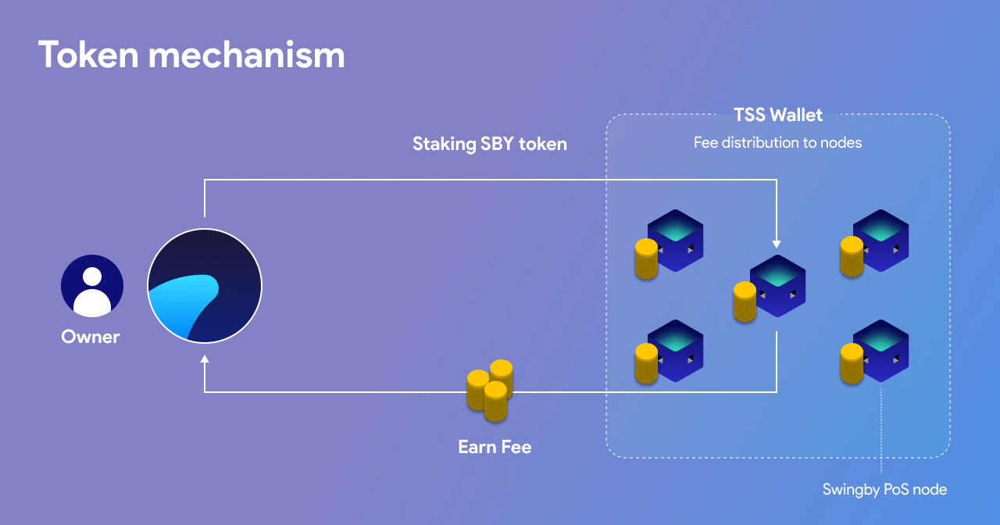

# Token mechanism

Swingby Skybridge node operators incur two costs: 

1. Operational costs for running a node – server costs.
2. Staking costs – they have to buy the SWINGBY token to 'bond' to their full node \(this helps to secure the network and keep nodes honest\).

There are two types of staking in a full Skybridge network:

1. SWINGBY staking – nodes that stake SWINGBY to participate in swaps will receive swap _fee / n_. This is also known as 'bonding'.
2. Float staking – users that deposit bridge currency will get swap fees proportional to their deposited amount of tokens. Anyone can do this - they don't necessarily have to own a node to do so.

Float staking is a concept specific to a Swingby Skybridge network – deposits on both source blockchain and target blockchains are utilized to allow for simple swaps, limiting the swap fee to be as low as possible for users.

Larger deposits allow frictionless swaps, and possibly more important, comfortability in using the bridged token on the target blockchain, as the user is able to swap back to source blockchain at any time. In essence, these deposits are “lent” to the bridge, and opportunity cost for depositing tokens need to be considered.

Thus, deposit based Skybridge need to provide sufficient interest on tokens so make it an attractive option for token holders. A portion of the swap fees are captured and distributed in order to reward depositors.

### **The SWINGBY token**

The token used in Swingby Skybridge is called "Swingby Token" \(or "SWINGBY"\). SWINGBY will be deployed as a BEP-2 token on Binance Chain. It is used to prove eligibility to participate in a TSS group. It will also be distributed for the growth of the Swingby network ecosystem. In addition to the Binance Chain, SWINGBY may be issued on other blockchains \(as peg, not affecting token supply\) that can be connected to Swingby Skybridge.

### **Utility as a staking instrument** 

Swingby Skybridge is designed as a permissionless network with no central authority that can determine who can participate in a group or not. The way this is achieved is that Swingby Skybridge node operators must prove that they own SWINGBY tokens on Binance Chain, and lock \(or stake\) them for as long as they intend to participate in a TSS group. To join a TSS group, a participant must acquire SWINGBY and have owned it for a period of time. They are then able to prove this when TSS rounds \(public key creation, signing events\) occur.

Nodes are selected to participate in signing \(and earn fees\) based on their seniority, that is how long time the node has been operational. A node will start accrue up-time once it fulfills the peer requirements and is connected to the network. It is a simple seniority prioritization and thus different from coin-age; a node need to fulfill the SWINGBY stake required, but adding more tokens on top of that will not affect its priority. Furthermore, removing SWINGBY tokens so that the node goes below staking threshold will reset the seniority to zero. The trade-off is that early adopter nodes are difficult to out-compete as long as they stay honest, potentially discouraging "young" nodes to join as standby. On the upside, it prevents late joiners to gain majority control by abusing a large stack of SWINGBY tokens. Instead, "young" nodes becomes encouraged to set up new bridges for tokens in demand to gain seniority as early adopters on that swap pair.

### **Non-SWINGBY staking**

Any bridge for tokens that are deposit-based will give "float staking". This type of bridge depends on deposits for liquidity, and any user, even users that are not running any node, can stake the bridged tokens to receive float staking rewards proportional to their deposited amount of tokens.

Float staking need to be done with proper risk consideration. 1-to-1 swaps need sufficient deposit on both sides of the bridge to ensure liquidity. Sudden demand in any of the bridge directions may potentially drain deposits on the target chain. With sufficient bridge track record, such risk may be chosen to be accepted. There are other approaches that mitigate the risk, for example dynamic value between pegs. Such implementation would consider the deposit amount on each side of the bridge and swap into tokens on the target chain based on the deposit proportion instead of 1-to-1. It's a demand based approach with less deposit risk, where the target chain ecosystem also get incentive to balance the bridge deposits.

### Token distribution **and circulation**

**Pre-staking**

Early adopters have the option to lock tokens for a bonus reward \(see Getting Started / [Pre-staking](../getting-start/how-to-stake/pre-staking.md)\). These rewarded tokens come from reserved ecosystem tokens and will increase circulating supply of SWINGBY. This is part of the token distribution schedule regardless of token market price, network activity, fees, and expenses.

**Full node staking**

Participating as a full node require both dedicated server resources and meeting the SWINGBY token requirement \(see Getting Started / [Full node staking](../getting-start/how-to-stake/node-staking.md)\). Full nodes will participate in signing transactions to receive the fees incurred by those transactions. Please remember that nodes are selected based on their age, and removing SWINGBY token stake from the node will reset the age to zero.

**Float staking**

Float staking may be done through deposits of the swapped tokens. As example, a BTC to BTC.B swap would have float staking using BTC and BTC.B; it would not use SWINGBY tokens as stake. It is similar to "lending" to the bridge as liquidity provider, and will incur an extra fee to transactions. This extra fee is distributed proportionally to the float stakes.

